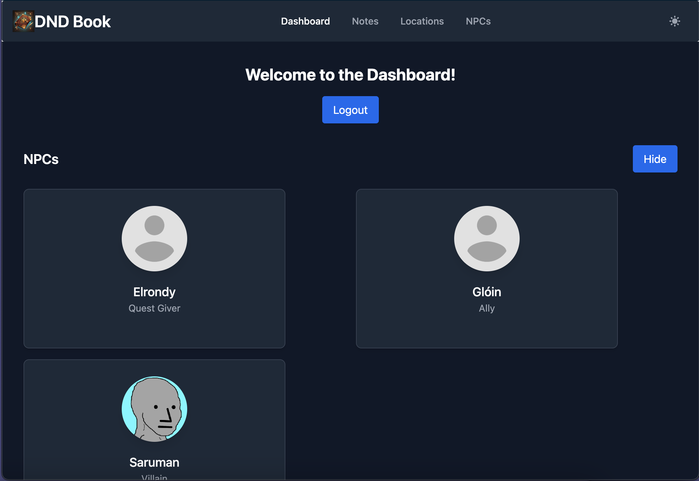
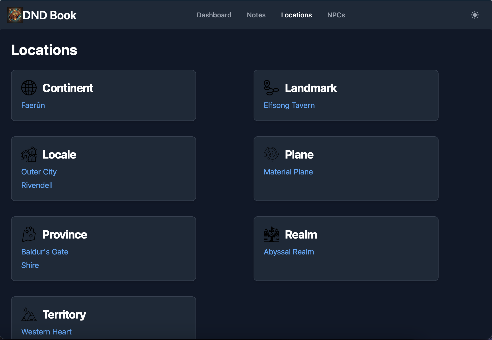
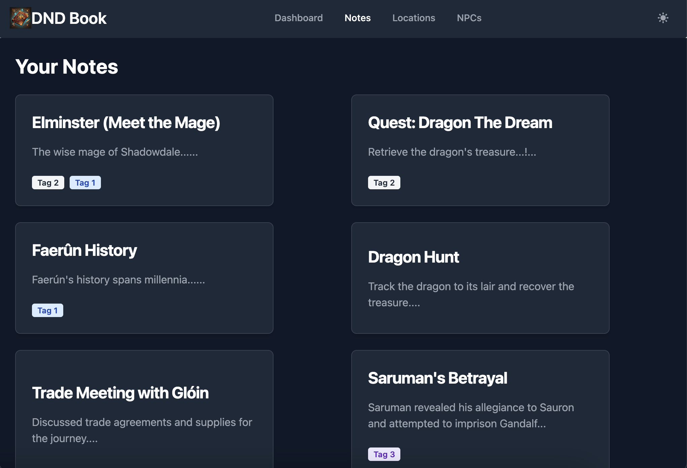
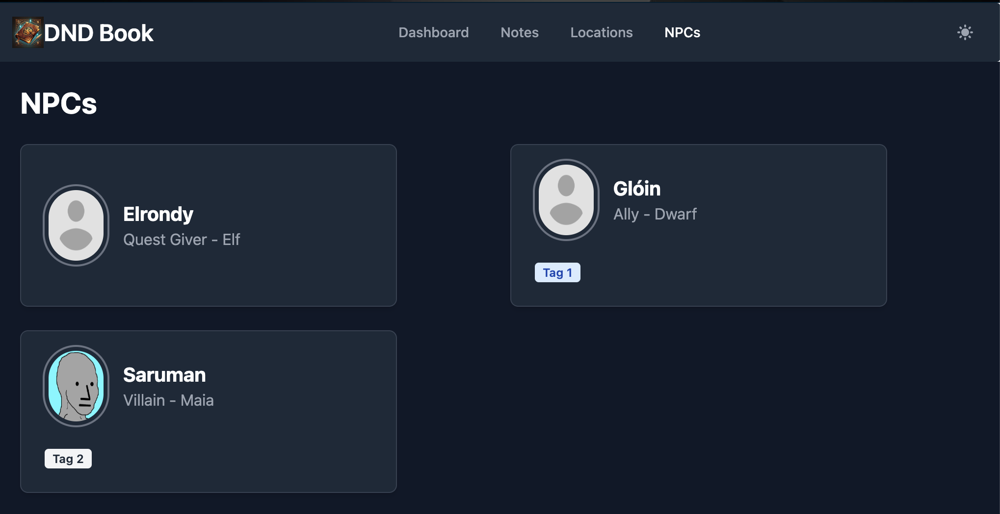
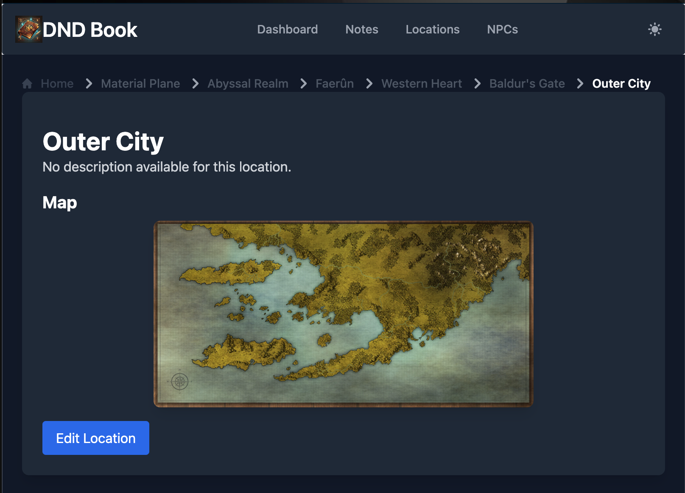
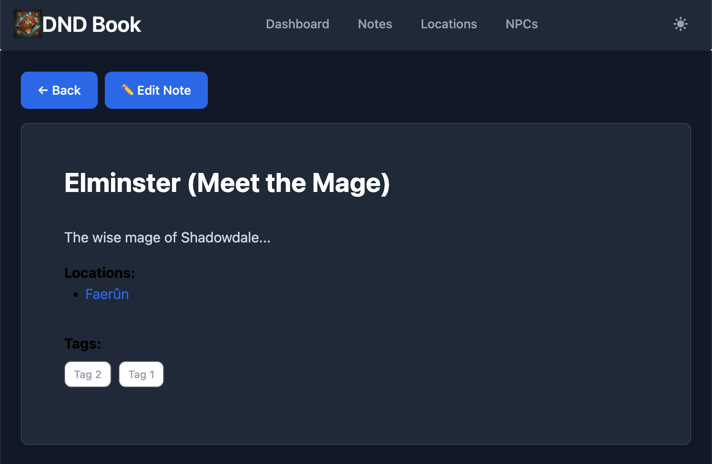
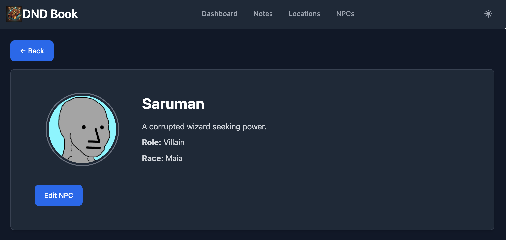
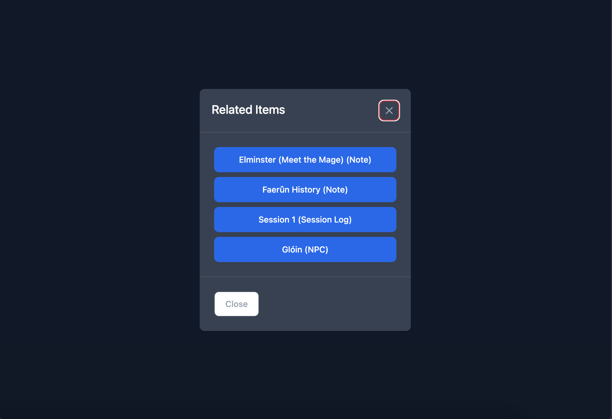
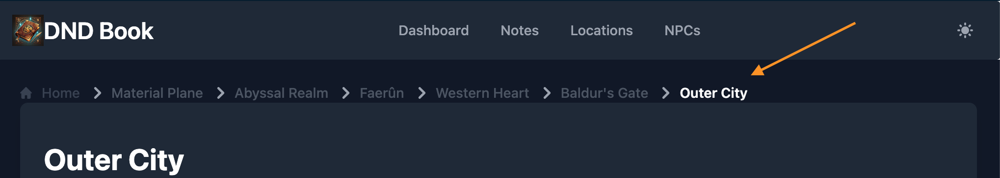

# DND Book

## 📌 Project Overview
DND Book is a **campaign management application** designed for Dungeon Masters and players to organize notes, NPCs, locations, and other key details of their tabletop RPG adventures. The project is built on **PocketBase** for backend storage and authentication, with a **React-based frontend powered by Vite**.

## 🎯 Goals
- Provide an **overview dashboard** summarizing campaign data.

- Allow filtering by **specific campaigns** across all entities (notes, NPCs, locations, etc.).
- Store and retrieve data efficiently via **PocketBase**.
- Ensure a **smooth, responsive UI** using **React, TailwindCSS, and Flowbite**.
- Support authentication and user-specific data with **secure token storage**.
- Implement a **global campaign selector** that persists across all pages.

## 🛠️ Tech Stack
- **Frontend:** React (Vite), React Router, TailwindCSS, Flowbite
- **Backend:** PocketBase (self-hosted)
- **Authentication:** PocketBase user auth system
- **State Management:** Local storage (transitioning to HttpOnly cookies for improved security)

## 📖 Credits
- **PocketBase**: The lightweight backend framework powering our data storage, authentication, and API layer. [Learn more](https://pocketbase.io/)
- **Flowbite**: UI components for TailwindCSS, making our design more seamless. [Learn more](https://flowbite-react.com/)
- **Vite**: A modern frontend tooling alternative to Create React App, providing fast development and optimized builds. [Learn more](https://vite.dev/)

## 📌 Features (Current & Planned)
### ✅ Current Features
- **User authentication** via PocketBase

- **Notes, Locations, NPCs pages**

- Detailed individual views for entries

- Viewing related items based on **tags**

- Breadcrumb navigation on the **Location** page

### 🏗️ Planned Features
- **Global campaign selection in navbar** to persist across all entity pages
- **Improved authentication security** (HttpOnly cookies)
- **Expanded filtering and sorting options** for notes and locations
- **Improved UI/UX with additional Flowbite components**
- **Basic campaign filtering on the dashboard**
- **Dashboard with campaign-wide data summary**

## 🚀 Deployment
🚧 *Coming soon...*

## 📝 Contribution
This project is being built iteratively, and future improvements are being planned based on evolving needs. Contributions and feedback are welcome!

## 📜 License
This project does not currently have a formal license. Usage is at the discretion of the creator.

